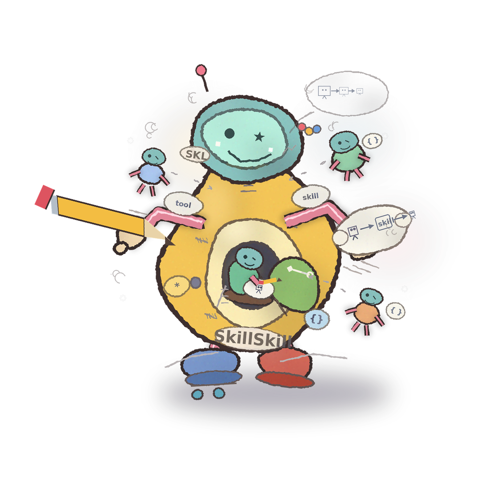

<p align="center"></p>

`/SkillSkill` is useful when a team has already figured out a workflow in one good AI session and wants to make it reusable. For example, imagine an engineer who spends 25 minutes teaching an assistant how to turn a week of merged PRs into release notes. The good result depends on lots of tacit instructions: group changes by feature, separate customer-facing updates from internal chores, call out migrations or risky changes, ignore reverted work, and end with a short QA checklist. `/SkillSkill` takes that successful chat and turns it into a real skill package with a clear trigger description, an output contract, edge cases, and examples. The next time someone asks for release notes, the agent can route to the skill instead of being retaught from scratch.

> Use `/SkillSkill` to turn this release-notes workflow into a reusable skill. The skill should trigger when someone wants release notes from merged PRs, group changes by feature, separate customer-facing notes from internal chores, call out migrations and risky changes, ignore reverted work, and end with a short QA checklist.

The result would be a reusable skill package that tells the agent when to use this workflow, what output to produce, and which edge cases to handle.

Compared with keeping the workflow as an ad hoc prompt, a skill gives you:

- Sharper routing: it's clearer when the skill should be invoked.
- Explicit contracts: it defines what the skill should return.
- Clearer workflow: it gives a more disciplined authoring process.
- Better edge-case coverage: it handles messy or ambiguous inputs more reliably.
- Cleaner separation of core behavior from platform-specific details: the method stays general instead of being tangled with one tool's packaging.

# /SkillSkill

Agent-readable skills, packaged as durable workflow assets.

/SkillSkill is for authoring, packaging, and validating high-quality skill files. Today it ships one skill, `/SkillSkill`, with dual packaging:

- the repo root is the canonical package for Codex-oriented use
- `.claude/skills/skillskill/` is the committed Claude Code mirror

The repo centers on `/SkillSkill`, its supporting references, and the validation workflow that keeps the package consistent across Codex and Claude.

## What `/SkillSkill` Does

`/SkillSkill` helps an AI:

- create a new skill from a workflow, prompt, transcript, or notes
- revise an existing skill so it routes and performs better
- critique a skill against a clear rubric and rewrite weak parts
- package the result for Codex when the request is Codex-specific

The methodology stays cross-tool by default. Packaging details are added only when the caller asks for a specific platform.

## Example Requests

- `Turn this workflow into a skill.`
- `Use this transcript to draft a reusable skill package.`
- `Use this prompt to create a skill.`
- `Critique this SKILL.md and rewrite weak parts.`
- `Revise this skill for Claude and Codex.`

## Worked Example

See [examples/frontend-skill-critique/README.md](examples/frontend-skill-critique/README.md) for a complete before-and-after example of using `/SkillSkill` to critique and rewrite an existing skill.

## Package Layout

- `SKILL.md`: canonical skill definition
- `agents/openai.yaml`: Codex metadata
- `.claude/skills/skillskill/SKILL.md`: Claude project-skill mirror
- `examples/`: worked documentation bundles showing real critique and rewrite flows
- `references/`: rubric and review checklist used by the skill
- `scripts/validate_skill.py`: dependency-free validator for package quality and drift
- `tests/fixtures/`: valid and intentionally broken fixtures for validator checks

## How To Use

### Both Tools

If you use both Codex and Claude personally, install both with:

```bash
./scripts/install.sh --all
```

### Codex

Install the clean Codex runtime package with:

```bash
./scripts/install.sh --codex
```

If you need to replace an existing install target:

```bash
./scripts/install.sh --codex --force
```

The installer copies only the runtime package into `${CODEX_HOME:-~/.codex}/skills/skillskill`.
It intentionally leaves out documentation examples, tests, and the Claude mirror so their nested `SKILL.md` files do not appear as callable Codex skills.

Then invoke it in Codex with `/SkillSkill`, for example:

- `/SkillSkill turn this workflow into a skill.`
- `/SkillSkill review this SKILL.md and rewrite weak parts.`

### Claude Code

This repo already contains a project-local Claude skill at `.claude/skills/skillskill/`, so anyone who opens this repo in Claude Code can use it in that workspace immediately.

If you also want a personal Claude install across all projects, run:

```bash
./scripts/install.sh --claude
```

That symlinks the committed Claude mirror into `${CLAUDE_HOME:-~/.claude}/skills/skillskill`.

From this workspace Claude Code can use it automatically when relevant or you can invoke it directly with:

```text
/SkillSkill
```

Example:

```text
/SkillSkill turn this transcript into a reusable skill
```

## Validation

Validate the canonical Codex package:

```bash
python3 scripts/validate_skill.py --expect-codex .
```

Validate both Codex and Claude packaging together:

```bash
python3 scripts/validate_skill.py --expect-codex --expect-claude .
```

The validator checks:

- required package files
- `name` and `description` frontmatter
- single-line descriptions
- contract, output, edge-case, and example guidance
- Claude description length limits
- drift between the canonical skill and the Claude mirror
