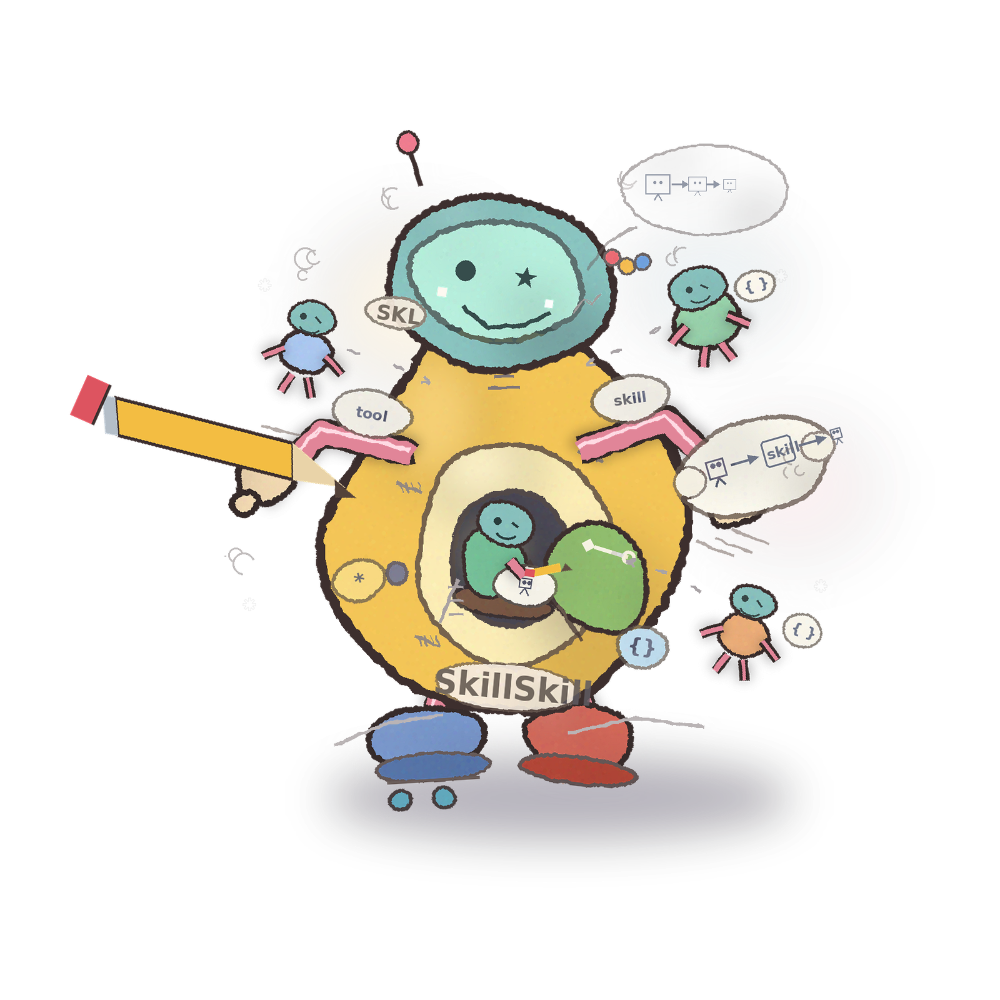

<p align="center"></p>

# SkillSkill

SkillSkill audits and improves agent-readable skill packages. Use it when a skill routes poorly, has a vague contract, mixes platform packaging with core behavior, or needs evidence-backed revision and regression coverage.

SkillSkill is strongest as the review layer around a platform's native skill creator. Let the native creator handle routine scaffolding. Use SkillSkill for deeper audits, targeted revisions, cross-platform ports, and behavioral evaluation.

Example:

> `$skillskill audit this release-notes skill. Check routing, output contracts, edge cases, packaging, and forward-test coverage. Keep the audit read-only.`

The result should identify the highest-impact problems, cite the relevant files or sections, and propose concrete replacements. SkillSkill only edits files when the request authorizes changes.

## What It Does

SkillSkill supports four modes:

- `Audit`: inspect an existing skill and return evidence-backed findings. Audit is the read-only default.
- `Evaluate / Benchmark`: test routing and execution behavior. Keep the package read-only; write only to authorized, isolated fixtures.
- `Revise / Implement`: make scoped edits to the requested package, preserve working conventions, and verify the result.
- `Port`: adapt the requested package or adapter for another platform while preserving the canonical contract.

Typical requests:

- `$skillskill audit this SKILL.md for routing and contract problems.`
- `$skillskill revise this package and validate every callable copy.`
- `$skillskill port this skill to Codex and Claude without duplicating the core methodology.`
- `$skillskill benchmark the current and proposed versions against the forward-test basket.`

## Canonical Package And Project Adapters

[`packages/codex/skillskill/`](packages/codex/skillskill/) is the single canonical, cross-compatible package.

The project-local adapters point to that package with tracked relative symlinks:

- `.agents/skills/skillskill` → `../../packages/codex/skillskill`
- `.claude/skills/skillskill` → `../../packages/codex/skillskill`

The symlinks keep Codex and Claude project discovery on the same files. No generated mirror can drift.

Personal installs work differently. [`scripts/install.sh`](scripts/install.sh) validates the canonical source, stages a copy beside the destination, and then installs a stable copy. The personal Codex or Claude install does not depend on the checkout remaining in place.

## Install

### From A Local Clone

Install for Codex:

```bash
./scripts/install.sh --codex
```

Install for Claude:

```bash
./scripts/install.sh --claude
```

Install both:

```bash
./scripts/install.sh --all
```

Existing targets are left untouched unless `--force` is explicit:

```bash
./scripts/install.sh --all --force
```

The destinations are:

- Codex: `${CODEX_HOME:-$HOME/.codex}/skills/skillskill`
- Claude: `${CLAUDE_HOME:-$HOME/.claude}/skills/skillskill`

### From GitHub In Codex

Ask the built-in installer to install the canonical package path:

```text
$skill-installer install https://github.com/mikeylong/SkillSkill/tree/main/packages/codex/skillskill
```

The package is available to a new Codex turn after installation.

## Use

Codex can select the skill from a matching request, or you can name it directly:

```text
$skillskill evaluate this skill against the routing and execution cases
```

In this repository, Codex and Claude discover the same canonical package through their project adapters.

## Validation And Tests

Run strict static validation from the repository root:

```bash
python3 scripts/validate_skill.py --expect-codex --expect-claude --strict-quality packages/codex/skillskill
```

Static validation checks deterministic rules for package structure, frontmatter, Codex metadata, local links, and required quality sections. A `STATIC PASS` means those checks passed, but does not prove that a model will route to the skill or follow it correctly.

Run the repository tests with:

```bash
python3 -m unittest discover -s tests -p 'test_*.py'
```

The test suite covers validator behavior, project-adapter topology, package hygiene, and the versioned evaluation manifest. The [forward-test basket](tests/evals/skillskill_behavior_cases.json) contains routing and execution cases for fresh-agent comparison. Manifest tests check the case schema and expected inventory; they do not run a model or produce an automated quality score. Use the [evaluation protocol](packages/codex/skillskill/references/evaluation.md) when measuring behavior.

## Worked Example

[`examples/frontend-skill-critique/`](examples/frontend-skill-critique/) contains a frozen before-and-after critique. It shows how SkillSkill tightens routing, adds a concrete contract and edge cases, and moves long guidance into a reference file.

## Repository Layout

- `packages/codex/skillskill/SKILL.md`: canonical methodology and behavior
- `packages/codex/skillskill/agents/openai.yaml`: Codex UI metadata
- `packages/codex/skillskill/assets/`: runtime icons
- `packages/codex/skillskill/references/`: scored audit rubric and evaluation protocol
- `packages/codex/skillskill/scripts/validate_skill.py`: validator shipped with the package
- `.agents/skills/skillskill`: Codex-compatible project adapter
- `.claude/skills/skillskill`: Claude project adapter
- `scripts/install.sh`: validated personal-copy installer
- `scripts/validate_skill.py`: repository validator
- `tests/`: validator tests and behavioral evaluation fixtures
- `examples/`: worked documentation bundles
